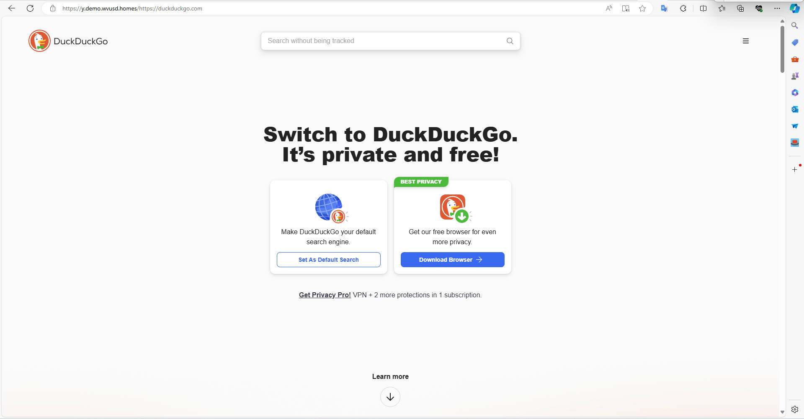

<h1>Cloudflare Proxy EX</h1>

[中文](https://github.com/1234567Yang/cf-proxy-ex) [English](https://github-com.translate.goog/1234567Yang/cf-proxy-ex?_x_tr_sl=zh-CN&_x_tr_tl=en&_x_tr_hl=zh-CN&_x_tr_pto=wapp)

 

<!-- &nbsp;&nbsp;-->

[💻 在线体验](#在线体验) &nbsp;| [⭐ 用法](#用法) &nbsp;| [🚀 快速开始](#快速开始) &nbsp;| [📈 基于原项目的改进](#基于原项目的改进) &nbsp;| [🔎 已知问题](#已知问题) &nbsp;| [📸 截图](#截图) &nbsp;| [📦 LICENSE](#license) &nbsp;| [📄 备注](#备注)

Cloudflare超级代理，OpenAI/ChatGPT代理，Github加速，在线代理。
 
<!--本项目是一款基于Cloudflare worker的在线代理。目前支持100%加载Github，Duckduckgo，Stackoverflow等网站，并且和打开原网站毫无差别。和其它开源代理以及hide.me在线代理相比，本项目可以加载更多静态资源、实现Cookie作用域管理、提交表单、相对URL转绝对URL，转跳自动补全网址等强大的功能。-->
 

# 在线体验

<!--
## 听说CF开始删除反代worker账号，暂停使用
-->

### 首页
https://y.demo.wvusd.homes/
### Duckduckgo聊天
https://y.demo.wvusd.homes/https://duckduckgo.com/?t=h_&q=hi&ia=chat
### Google地图
https://y.demo.wvusd.homes/https://www.google.com/maps

# 用法
* 在cloudflare网站中新建worker，把worker.js文件中的内容复制进去即可使用。
* 在任意网址前面加上https://你的域名/ 例如https://你的域名/https://github.com
* 本项目基于[gaboolic的cloudflare-reverse-proxy](https://github.com/gaboolic/cloudflare-reverse-proxy/)

# 快速开始
* 登录https://www.cloudflare.com/
* 创建应用程序
* 创建worker（pages麻烦一点，需要写一个package.json文件，但pages的好处是分配的域名直接可以用）
* 点"部署"按钮
* 编辑代码
* 把worker.js文件中的内容复制进去，点"保存并部署"
* (可选) 添加自定义域
 

* 免费域名申请：https://secure.nom.za/  https://nic.eu.org/   https://nic.ua
* 不需要申请，link域名0元免费1年：https://dynadot.com/
* 域名购买：https://porkbun.com/  https://domain.com/ 购买时可以Ctrl + F，搜素`$0.`

# 基于原项目的改进
* 去掉`/proxy/`，方便使用。我看到有issue说了，但是作者说想添加引导界面，这个问题我也解决了。
* 手动处理转跳事件（3XX），防止一些相对资源加载不出来。
* 判断欲代理的网址是否以`http`开头，如果不是就自动加上。
* 把Header里所有有关代理网址的信息全部换成要代理的网站的信息，防止某些网站阻止代理。
* 相对路径全部转换绝对路径，方便加载资源（如JS，CSS等）。
* Cookie作用域修改成仅当代理那个网站时，防止Cookie太大服务器发来400 bad request，同时也防止恶意网站获取所有Cookie。
* 把`XMLHttpRequest`和`fetch`注入返回的HTML，这样也可以提交表单数据。
* 把一个文档监视器注入到返回的HTML，这样有新的链接也可以相对转绝对。
* 修改`Content-Security-Policy`和`X-Frame-Options`的Header，实现可代理Duckduckgo，同时也解决了一些网站打不开的问题。
* 在返回的时候，如果是HTML，那么添加`"Content-Type": "text/html; charset=utf-8"`，防止一些较为古老的中文网站打开出现`锟斤拷`，`烫烫烫`的问题。
* 添加最后访问网址的Cookie，可以解决搜素引擎搜素之后出现异常的情况，如：`https://the proxy/https://www.duckduckgo.com/`会转到`https://the proxy/?q=key`。
* 优化了一些代码。

# 安全密码
安全密码利用Cookie，在设置了密码的情况下，会先检测是否有密码Cookie以及是否正确，如果不正确那么可以设置输入密码界面，或者直接403。密码Cookie默认名称为`passwordCookieName`，设置密码可以代码里搜索`const password = "";`并替换成你的密码。
更详细的教程可以[点这里](https://github.com/1234567Yang/cf-proxy-ex/blob/main/security_password_tutorial.md)

# 已知问题
* 如果原界面同样重写了`XMLHttpRequest`和`fetch`（如Reddit），那么部分请求可能异常
* 这个项目目前代理不了youtube（403不知道是屏蔽了还是其他的东西做了Url验证）。但是遥遥领先的是大鹅的流量被屏蔽了，导致有一堆镜像站点（自己搜Invidious），经过测试这个镜像站点可以代理youtube。
* 正在处理twitter代理，可能需要等几个周/月。

# 截图

# LICENSE
MIT License + 一些条件 
* 凡是使用本项目建立的代理站点，务必备注此开源链接。
* 禁止使用本项目盈利，包括基于本项目的项目。

# 备注
* # 此项目仅供学习在线代理的原理和实现方式使用，严禁用于从事违法违规活动！
无规矩难以成方圆。国无法不治，民无法不立。人人守法纪，凡事依法纪，则社会安定，经济发展。倘若没有纪律的规范，失去法度的控制，各项秩序就无从保证，人们生存、发展的环境就会遭到破坏，人民群众就不可能安居乐业。在我国，依法治国的方略正在大力实施，构建社会主义和谐社会已深入人心。我们每个公民更应该懂得遵纪守法的重要性、必要性，做到明纪、知法、守法，推动法治建设和社会和谐。 “以遵纪守法为荣、以违法乱纪为耻”，强调的是一种行为方式，人生准则；唤起的是人的良知，彰显的是人生自律的力量，倡导的是社会主义的法治观、道德观。历史与现实都已反复证明，遵纪守法的本源是道德良知。人要自爱，要爱他人，起码应该做到“不逾矩”，敬畏法度，在法纪允许的范围内活动。因为法律和纪律是为了维护全体人民的共同利益而制定的，神圣庄严，不可违背，不可侵犯，所以才要自觉用法纪来约束自己的行为，对违纪之行、“越轨”之事，不想干、不愿为，从而保持人格气节，创造美好人生。 　　

有道是“法网恢恢，疏而不漏”。那些藐视法纪、践踏法纪的行为，必然受到法纪的惩处。但只要有社会、人群，就难免有违法乱纪行为，就可能会有人去扰乱社会秩序，扰乱安定团结的局面。因此，每一个具有道德良知、法纪意识的公民，都应自觉地拿起法纪这一有力武器，与各种违法乱纪行为作坚决的斗争。大家齐心协力，才能营造出这样一种社会状况：遵纪守法的人感到光荣、自在，得到尊重和支持；违背法纪的行为被斥责、抵制，个别违法乱纪之人被绳之以法。到处井然有序，人人崇尚法治，这样的社会才会令人向往，才充满生机和希望。

* 请不要通过在线代理登录任何网站。虽然本项目中已经限制了Cookie的作用域，也就是说理论上是可行的，但是非常不建议。像是这个项目原版的代理，它Cookie是全局的。也就是说如果你（通过代理）登录了Github然后访问恶意网站，你的所有Cookie就给你偷走了。
* 由于作者意识到了online proxy的弊端，决定 ~~开辟新赛道，探索新蓝海，不断塑造发展新动能新优势，积极实施新旧动能转换，通过产业链横向整合实现降维打击……~~ 写一个客户端模式的cf-proxy，大概和Tor差不多的思路。~~正在积极开发ing~~ 墓前情况良好。
