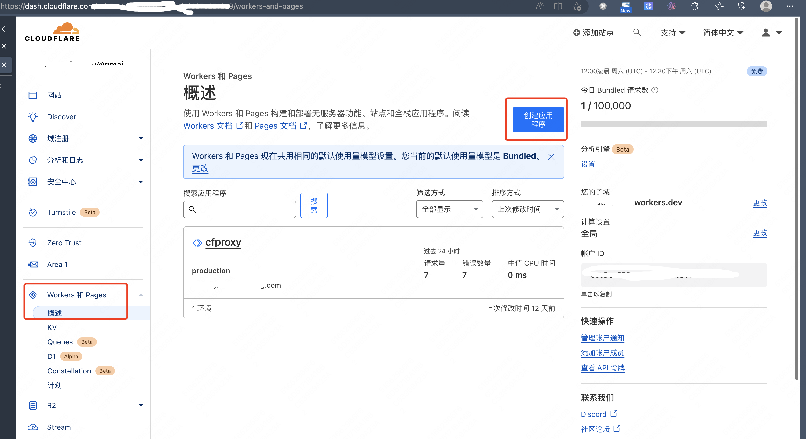
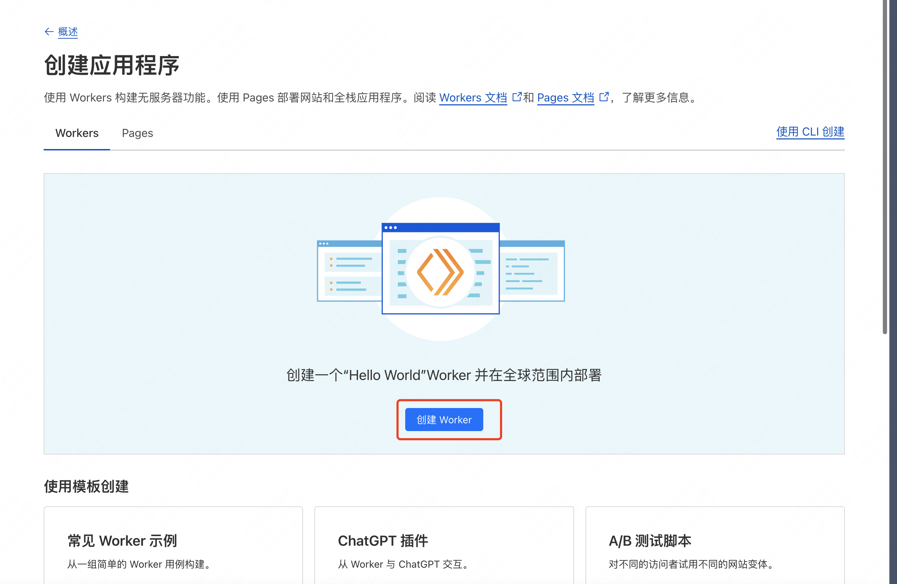
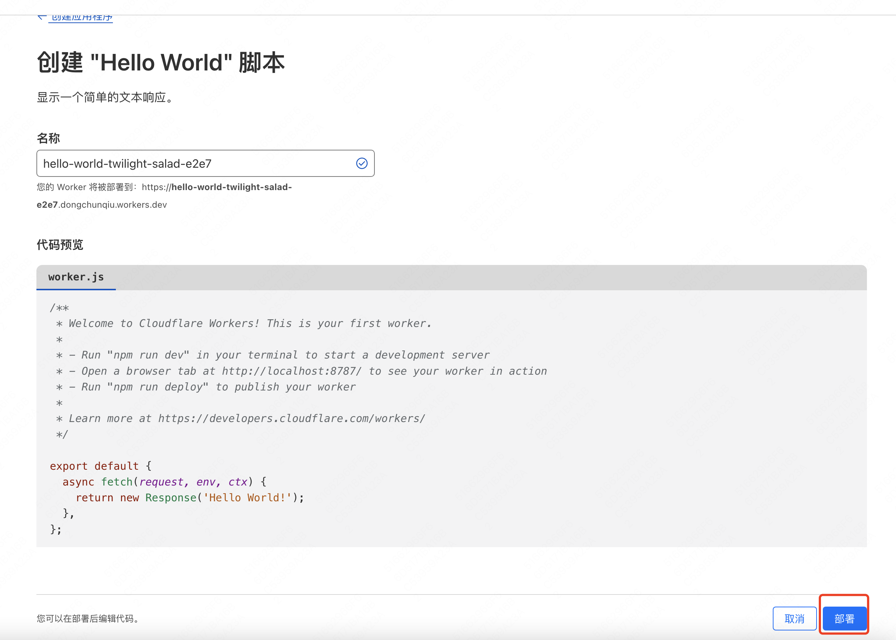
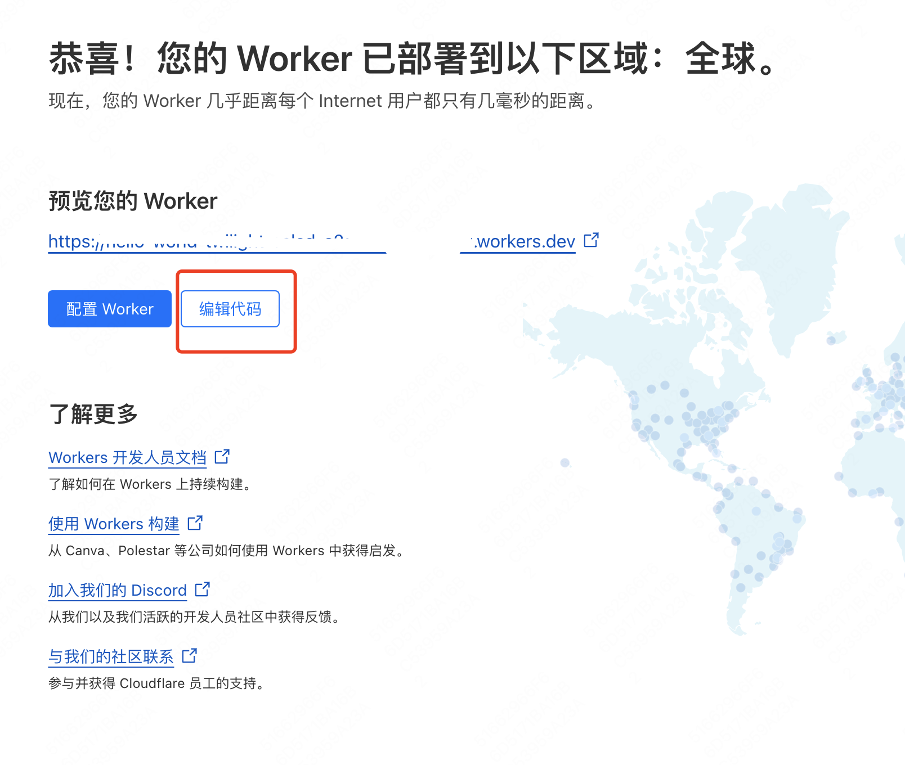
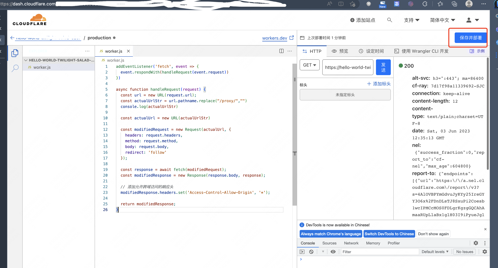

> [!CAUTION]
> 根据[Cloudflare ToS](cloudflare.com/terms) 2.2.1 (j)，您不能在任何情况下对本项目进行在Cloudflare上的实际的架设和使用，您只能并且仅限于学习本项目中的在线代理的实现方式，或者使用Cloudflare开源的worker-runtime在自己的服务器上部署，否则后果自负。
>
> 本项目仅用于学习在线代理的实现方式，用cloudflare-worker代码只是因为方便编写，绝无任何引导目的。

> [!CAUTION]
> 经过[实际测试](img/cf_realip.png)，Cloudflare代理会将你的真实IP通过`X-Forwarded-For`、`X-Real-Ip`、`Cf-Connecting-Ip`传递给目标网站，可能导致个人信息泄漏。同时，它还会通过`Cf-Worker`将你的Worker域名发送给目标网站。
>
> 最初发现在：https://linux.do/t/topic/89856

* 登录https://dash.cloudflare.com/
* 创建应用程序

* 创建worker

* 点"部署"按钮

* 编辑代码

* 把worker.js文件中的内容复制进去，点"保存并部署"

> [!TIP]
> 如果你选择不开启安全密码，那么你可以转到Website -> Security -> Bots ->开启所有防护（Bot Fight Mode + Block AI bots）
