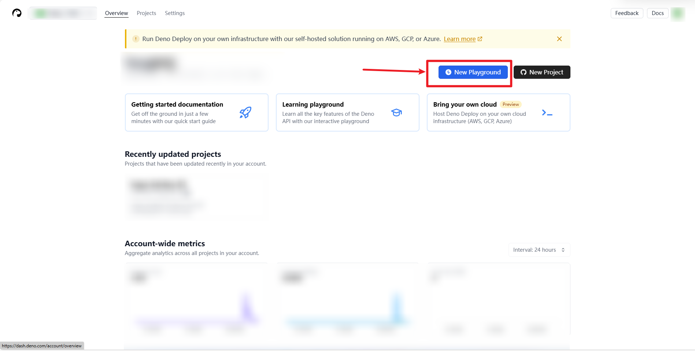
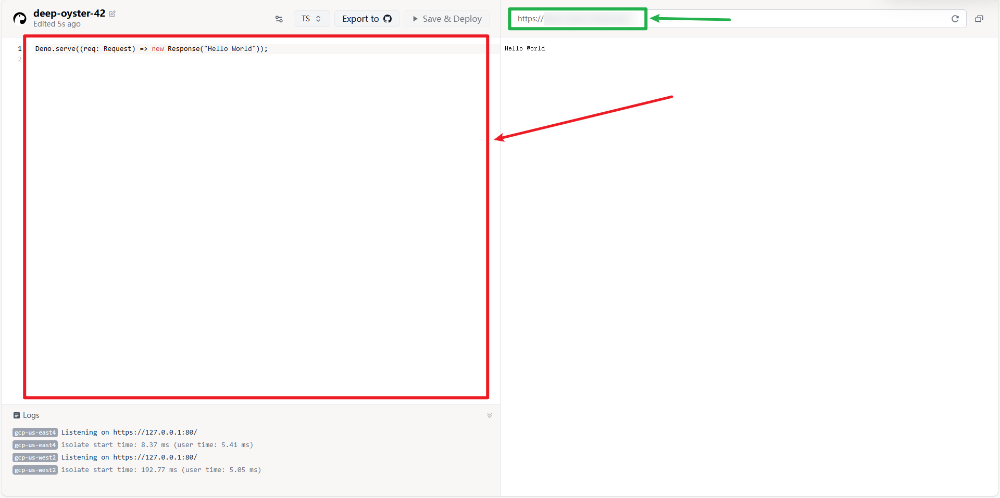

* 登录https://dash.deno.com/
* 如果是第一次使用，请点击"I know what I am doing, skip tutorial"
* 点击“New playground"

* 把worker.js文件中的内容复制进去

* 将`addEventListener`那一块替换为以下代码：
```
Deno.serve((req: Request) => {
    const url = new URL(req.url);
    thisProxyServerUrlHttps = `${url.protocol}//${url.hostname}/`;
    thisProxyServerUrl_hostOnly = url.host;

    // Example handleRequest function usage
    return handleRequest(req);
});
```
* 点"Save & Deploy"（在红框右上角）
