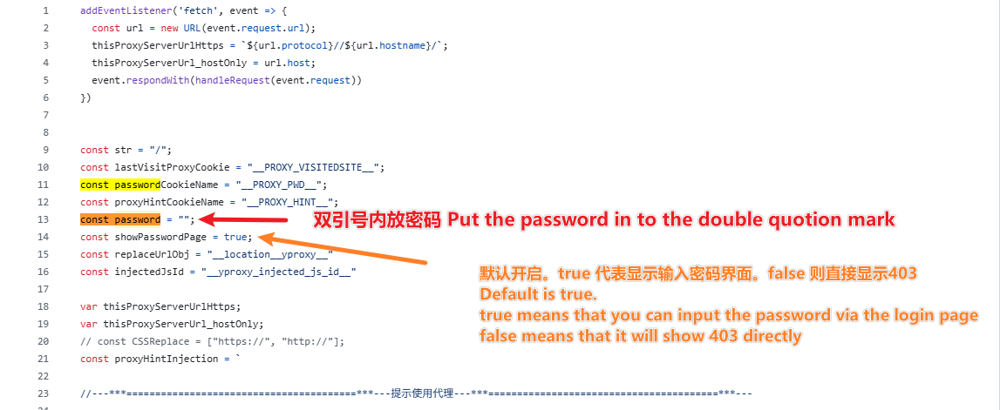

# 如何设置安全密码：

<div align="center">
  
[中文](https://github.com/1234567Yang/cf-proxy-ex/blob/main/security_password_tutorial.md) 
[English](https://github-com.translate.goog/1234567Yang/cf-proxy-ex/blob/main/security_password_tutorial.md?_x_tr_sl=zh-CN&_x_tr_tl=en&_x_tr_hl=zh-CN&_x_tr_pto=wapp)
</div>

## 1：使用环境变量（推荐）

如果您使用的是 Cloudflare Workers 部署，可以通过设置环境变量来配置密码，而无需修改代码：

1. 登录 Cloudflare 控制台。
2. 进入您的 Worker 项目。
3. 点击 **Settings** (设置) -> **Variables** (变量)。
4. 在 **Environment Variables** (环境变量) 部分，点击 **Add variable** (添加变量)。
5. **Variable name** (变量名称) 填入 `PROXY_PASSWORD`。
6. **Value** (值) 填入您想设置的密码。
7. 点击 **Save and deploy** (保存并部署)。

这样设置后，程序会优先使用环境变量中的密码。

## 2：修改worker代码

`Ctrl + F` 找到密码行：

```javascript
const password = ...
```



## 如果选择打开 `showPasswordPage`，那么可以直接输入密码（有效期1周），无需后续步骤。
默认打开 `showPasswordPage`。

## 打开开发者工具（Dev tool），转到程序->Cookie->双击新建Cookie


### 如果想设置临时Cookie的话可以控制台（Console）输入：
`document.cookie += "__PROXY_PWD__=your_password; path=/; domain=your_domain`
注意替换`your_password`和`your_domain`。

---

## 如何关闭密码验证 (How to disable password protection)

如果您想公开访问代理，可以关闭密码验证：

1. **环境变量**：将 `PROXY_PASSWORD` 的值设置为 `false` 或直接留空。
2. **修改代码**：将 `password` 变量修改为 `""` 或 `"false"`。
