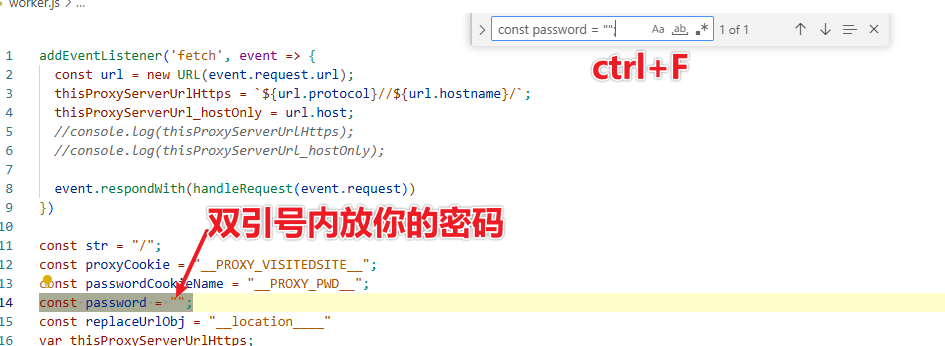
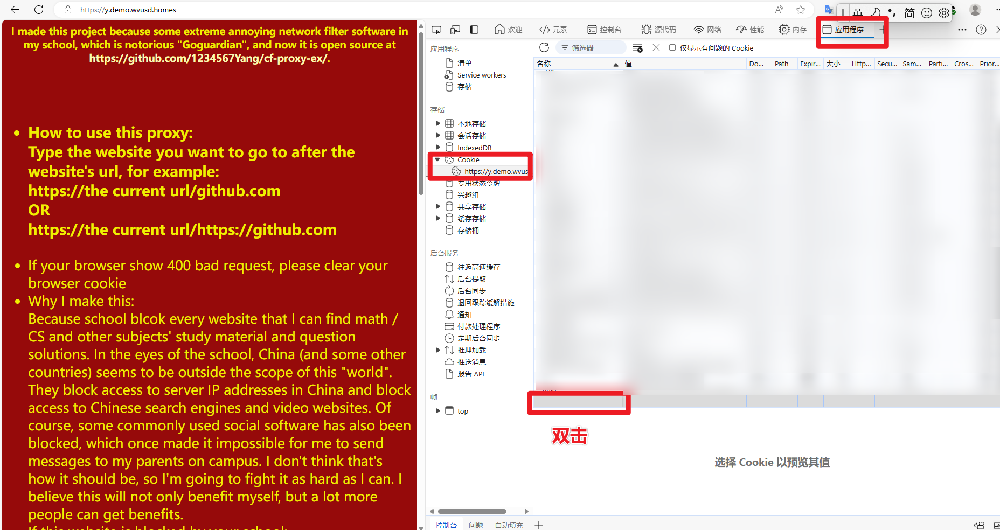
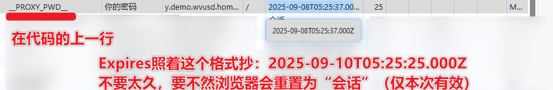

# 如何设置安全密码：

  
[中文](https://github.com/1234567Yang/cf-proxy-ex/blob/main/security_password_tutorial.md) 
[English](https://github-com.translate.goog/1234567Yang/cf-proxy-ex/blob/main/security_password_tutorial.md?_x_tr_sl=zh-CN&_x_tr_tl=en&_x_tr_hl=zh-CN&_x_tr_pto=wapp)

## 1：修改worker，`Ctrl + F`找到密码行

## 如果选择打开`showPwdPage`，那么可以直接输入密码（有效期1周），否则会显示403，需要按照以下方法操作
默认打开`showPwdPage`

## 打开开发者工具（Dev tool），转到程序->Cookie->双击新建Cookie

### 如果想设置临时Cookie的话可以控制台（Console）输入：
`document.cookie += "__PROXY_PWD__=your_password; path=/; domain=your_domain`
注意替换`your_password`和`your_domain`。

## Cookie名称是在密码附近可以找到的

